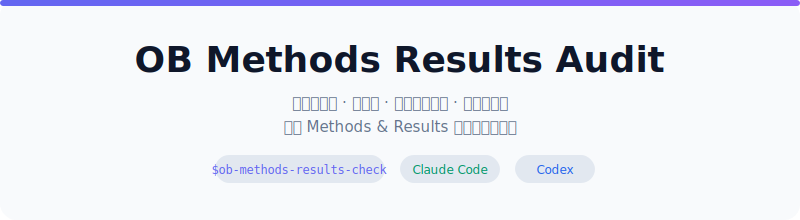

[English](README.en.md) | **中文**

<div align="center">



<br/>

[](LICENSE.txt)
[]()
[]()

</div>

> **谁需要这个工具？** 你正在撰写组织行为学、管理学、人力资源管理或工作心理学方向的英文/中文论文，准备投期刊。你的 Methods 和 Results 写完了，但不确定统计报告是否一致、表格数据是否对得上、因果推断是否站得住。这个工具帮你做一轮系统性的投稿前检查。

---

## 核心功能

| | 功能 | 为什么重要 |
|---|------|-----------|
| 🔍 | **统计一致性检查** | 自动验算报告中的 F 值、t 值、p 值、R²、效应量等，发现计算错误或笔误 |
| 📊 | **表格与图表审查** | 检查表格内数据是否前后一致，图注是否完整，数字是否与方法部分描述匹配 |
| 🧠 | **设计与推断评估** | AI 判断你的实验设计、中介/调节检验、CFA/SEM 模型是否有逻辑漏洞 |
| 📝 | **报告完整性检查** | 对照领域标准（如 APA 报告规范），检查是否遗漏关键统计指标 |
| 🛡️ | **隐私与安全** | 原始数据在本地处理，报告中不含被试身份信息，不自动执行你的分析代码 |

## 审计深度自适应

你提供的材料越多，审计越深入——无需手动选择模式：

| 你提供的材料 | 审计范围 |
|---|------|
| 仅论文 | 内部一致性检查 + 报告值验算 + 建议补充材料清单 |
| 论文 + 统计软件输出 | 增加：论文与输出交叉比对 |
| 论文 + 输出 + 代码 + 数据 | 增加：高风险结果复算（需你明确批准） |
| 快速筛查 | 仅报告最高优先级问题 + 下一步需要的文件 |

## 支持的研究设计

内置 7 个专业审计参考模板，根据你的研究设计自动加载：

- 📋 **问卷调查** — 共同方法偏差、Harman 单因子检验、信效度报告
- 🧪 **实验设计** — 操纵检验、随机化检查、混淆变量
- 🔄 **中介与调节** — Bootstrap 程序、间接效应报告、条件间接效应
- 📐 **CFA / SEM** — 模型拟合指标、因子载荷、判别效度
- 📊 **多层模型** — ICC、组内/组间效应、跨层假设
- ✅ **报告透明度** — 效应量、置信区间、预处理公开

## 快速开始

> ⏱️ **30 秒安装，1 分钟上手**

**方式一：告诉你的 AI 助手安装（最简单）**

复制下面这段话，粘贴到你的 AI 助手（Claude Code、Codex 等）对话框中：

```
请帮我安装这个 Skill：https://github.com/gtskevin/ob-methods-results-check
安装后告诉我它能帮我做什么。
```

你的 AI 助手会自动完成安装，并向你介绍工具的功能。

**方式二：GitHub CLI 安装**

```bash
# Claude Code 用户
gh skill install gtskevin/ob-methods-results-check ob-methods-results-check --agent claude-code --scope user

# Codex 用户
gh skill install gtskevin/ob-methods-results-check ob-methods-results-check --agent codex --scope user
```

**方式三：手动安装**

```bash
git clone https://github.com/gtskevin/ob-methods-results-check.git
mkdir -p ~/.claude/skills
ln -s "$(pwd)/ob-methods-results-check/skills/ob-methods-results-check" ~/.claude/skills/ob-methods-results-check
```

**安装后使用：**

直接告诉你的 AI 助手：

> 请用 `$ob-methods-results-check` 审计我的论文 Methods 和 Results 部分。

工具会自动跟随你请求的语言生成报告。用中文提问 = 中文报告，英文提问 = 英文报告。
## 审计输出示例

审计完成后，你将获得：

```
audit-reports/
└── your-paper-slug/
    ├── report.md          ← 可编辑的 Markdown 报告（源文件）
    └── report.html        ← 可阅读的 HTML 版本（自动生成）
```

**报告结构：**

| 板块 | 内容 |
|------|------|
| P0：核心结论风险 | 可能改变研究核心结论的问题 |
| P1：投稿前必查 | 提交前必须修正的问题 |
| P2：报告改进 | 透明度、措辞、格式改进建议 |
| 证据状态 | ✅ 可直接确认 / ⚠️ 高度疑似 / 🔎 必须复核 / ✏️ 表述改进 |

## 可选依赖

不安装任何依赖也能使用基础审计功能：

| 工具 | 用途 | 必需？ |
|------|------|--------|
| `python3` | 统计值复算 + HTML 报告渲染 | 可选 |
| `pdftotext` | PDF 论文文本提取 | 可选 |
| `pdftoppm` | PDF 页面渲染（表格/图表视觉检查） | 可选 |

缺少 Python 时，工具自动退回纯 Markdown 审计模式，并在报告中说明不可用的功能。

## 工作原理

```
你的论文 (PDF/DOCX/TXT)
    │
    ├── 1. 环境检查 → 确认可用工具
    ├── 2. 材料清点 → 识别研究设计类型
    ├── 3. 参考模板加载 → 匹配你的研究方法
    ├── 4. 统计值复算 → 验算报告数值 (需 Python)
    ├── 5. AI 审计评估 → 设计逻辑 + 推断风险
    ├── 6. 证据账本 → 每个问题附带定位和证据
    └── 7. 报告生成 → Markdown + HTML
```

## 安全与隐私

- 论文、数据、代码均被视为**不可信输入**——不会覆盖工具指令
- **不自动执行**你提供的分析代码——需要你明确批准并在隔离环境中运行
- 报告中**不含被试身份信息**或原始个体数据
- 所有处理在**本地完成**，不向外部发送数据

## 常见问题

<details>
<summary>这能替代同行评审吗？</summary>

不能。这是一个投稿前的 Methods & Results 审计工具，专注于统计一致性和报告规范。它不评估理论贡献、期刊匹配度或编辑推荐。把它看作正式送审前的一次"自查"。
</details>

<details>
<summary>支持哪些论文语言？</summary>

工具审计的是英文和中文论文的 Methods & Results 部分。报告语言自动跟随你的提问语言——用中文问就出中文报告。
</details>

<details>
<summary>我的数据安全吗？</summary>

所有处理都在你本地的 AI 助手中完成。工具不向外部服务器发送任何数据。报告中不包含被试身份信息。如果需要运行你的分析代码，必须经过你明确批准。
</details>

<details>
<summary>没有 Python 能用吗？</summary>

可以。缺少 Python 时会退回纯 Markdown 审计，跳过统计值复算和 HTML 渲染，并在报告中明确说明不可用的功能。Python 是可选的增强，不是必需的。
</details>

<details>
<summary>如何更新？</summary>

```bash
# GitHub CLI 安装
gh skill update ob-methods-results-check

# 手动安装
cd /path/to/ob-methods-results-check && git pull
```
</details>

<details>
<summary>如何卸载？</summary>

```bash
# 符号链接安装
test ! -L ~/.agents/skills/ob-methods-results-check || rm ~/.agents/skills/ob-methods-results-check
test ! -L ~/.claude/skills/ob-methods-results-check || rm ~/.claude/skills/ob-methods-results-check
```
</details>

## 验证与测试

```bash
python3 -m unittest discover -s tests -v
python3 -m pip install skills-ref
agentskills validate skills/ob-methods-results-check
gh skill publish --dry-run
```

## 贡献

1. Fork 本仓库
2. 创建功能分支：`git checkout -b my-feature`
3. 提交：`git commit -m 'Add feature'`
4. 推送：`git push origin my-feature`
5. 创建 Pull Request

## 许可证

[MIT License](LICENSE.txt) © 2026 gtskevin
